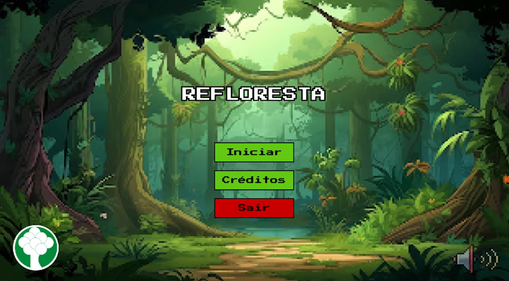
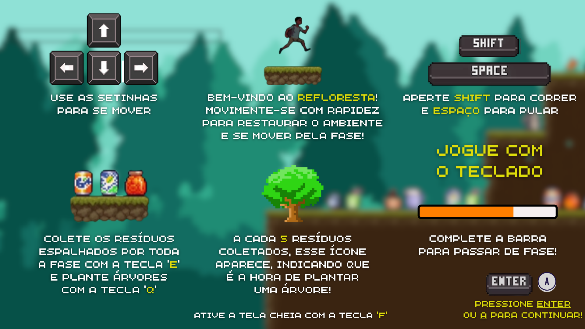
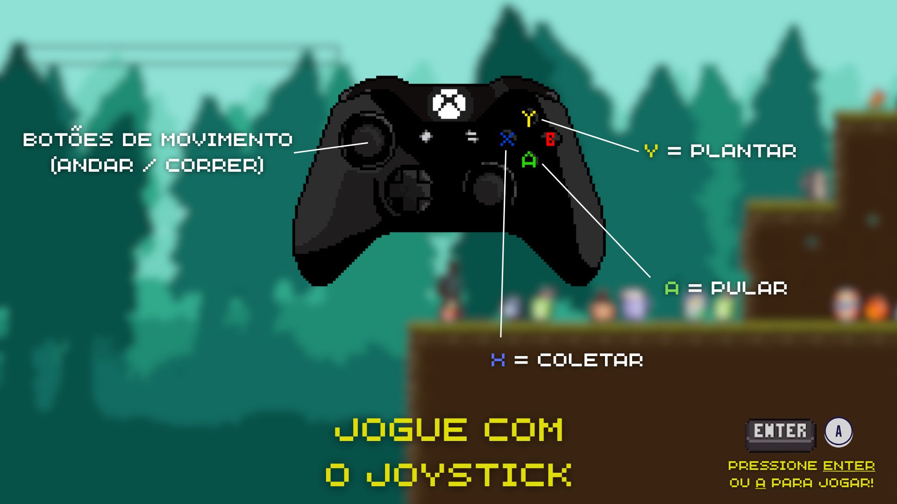
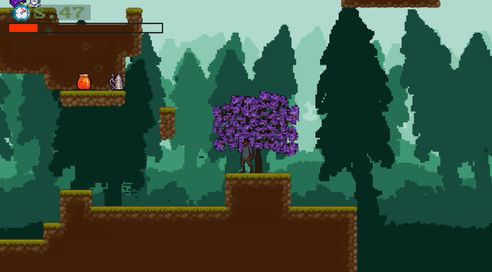
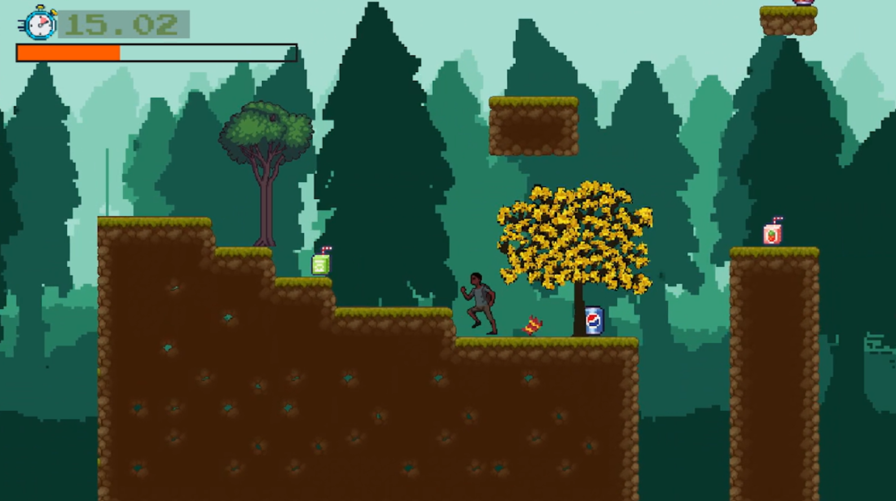
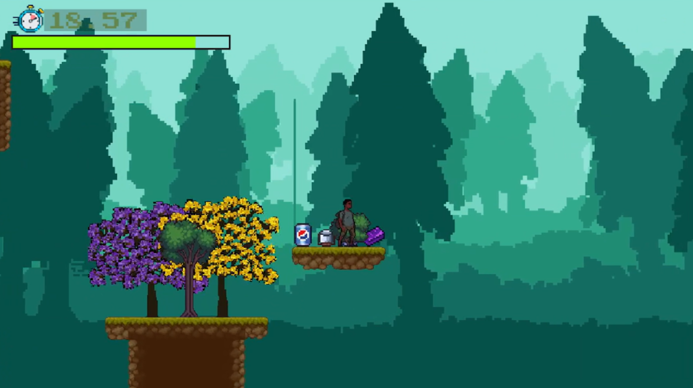
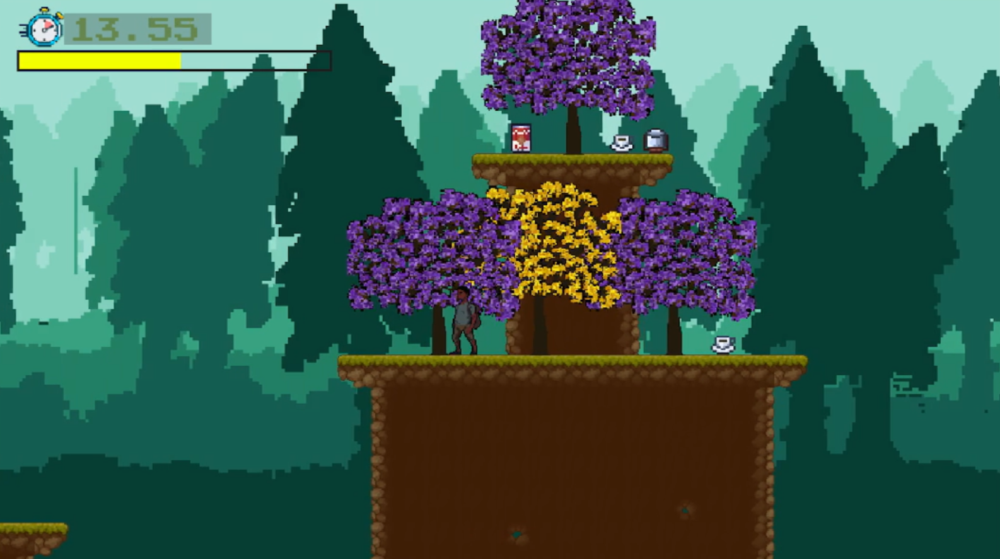

# 🌳 ReFloresta 🎮

<font color="green">*ReFloresta*</font> é um jogo educativo, desenvolvido por alunos de graduação do 1º período em Análise e Desenvolvimento de Sistemas (ADS)/UniFAFIRE, que combina diversão e consciência ecológica, alinhado ao ODS 15 (Vida Terrestre). Ajude a restaurar as florestas dos cenários enquanto se diverte e aprende sobre sustentabilidade!

> 🕹️ **Diferencial**: Além do teclado, o jogo é totalmente compatível com **joystick** (controle USB), oferecendo uma experiência mais acessível e imersiva!

---

## Índice
- [🌎 Visão Geral](#-visão-geral)
- [🎮 Funcionalidades](#-funcionalidades)
- [🕹️ Controles do Jogo](#️️-controles-do-jogo)
- [👩🏽‍💻 Equipe e Contribuições](#equipe-e-contribuições)
- [📸 Capturas de Tela](#-capturas-de-tela)
- [📥 Como baixar e executar o ReFloresta](#-como-baixar-e-executar-o-refloresta)
- [📂 Estrutura do código](#-estrutura-do-código)
- [Assets utilizados](#assets-utilizados)
- [📜 Licença](#-licença)
 
---

## 🌎 Visão Geral
O *ReFloresta* é um jogo 2D desenvolvido em PyGame, onde o jogador:
- Coleta resíduos virtuais para pontuar;
- Planta árvores e recupera o ambiente;
- Aprende o valor da restauração ambiental de forma divertida.

🎯*Objetivo*: Promover a conscientização ambiental através da gamificação, especialmente para estudantes.

---

## 🎮 Funcionalidades
- 🧃 *Sistema de Coleta*: Ação para recolher resíduos e limpar o ambiente.
- 🌳 *Plantio de Árvores*: Restaura áreas degradadas ao plantar mudas.
- ⏱️ *Cronômetro*: O cronômetro inicia no começo de cada fase, e é usado para pontuação.
- ⚡ *Nota de performance*: Quanto mais rápido completar a fase, maior será a sua nota (até 3 estrelas ⭐⭐⭐).
- 🕹️ *Suporte a Joystick*: O jogo pode ser jogado com controle USB, oferecendo acessibilidade e conforto!

<!--   comentar sem mostrar na tela  🌱➡️🥫🥤🎉🔇🔊📍🌎🛶  -->

---

## ⌨️🕹️ Controles do Jogo

| Ação              | Teclado         | Joystick (Controle USB)     |
|-------------------|-----------------|------------------------------|
| Mover o personagem | Setas (← ↑ ↓ →) | Alavanca analógica esquerda  |
| Correr            | Shift           | Alavanca analógica esquerda  |
| Pular             | Barra de espaço | Botão A                      |
| Coletar resíduo   | Tecla E         | Botão X                      |
| Plantar árvore    | Tecla Q         | Botão Y                      |
| Tela Cheia        | Tecla F         |                              |

> Os comandos foram pensados para oferecer suporte completo, tanto para teclado quanto para joystick — tornando o jogo mais inclusivo para diferentes tipos de jogadores.

---

## Equipe e Contribuições: 
 ### 👩🏽‍💻🧑🏿‍💻 Contribuições dos integrantes no projeto:

| Nome                   | Contribuições                                                                                  | Roles | Linkedin | Github |
|----------------------- |------------------------------------------------------------------------------------------------| --- | --- | --- |
| Camila Moura        | Gestão, Documentação, Desenvolvimento, Design, Site, Apresentação do projeto, Controle de qualidade geral, Readme      | Scrum Master |  [/camilacelestino](https://www.linkedin.com/in/camilacelestino) | [/ccelesti](https://github.com/ccelesti) |
| Davi Wanderley       | Desenvolvimento, Design, Apresentação do Projeto, Executável, Link de download                                        |  Tech Leader | [/odaviespecifico](https://www.linkedin.com/in/davi-wanderley-9512042a8/) | [/Odaviespecifico](https://github.com/Odaviespecifico)
| Samuel Victor            | Gestão, Documentação, Desenvolvimento, Design, Site, Apresentação do projeto, Readme                                        |  Product Owner   | [/samuel-victor](https://www.linkedin.com/in/samuel-victor-3426b3368/) | [/samuel-victorr](https://github.com/SamuelVictorr) |
| José Miguel      | Desenvolvimento, Design, Documentação         |  | [/miguel-leao](https://www.linkedin.com/in/miguel-leao-157aa5368/) | [/JM8778](https://github.com/JM8778) |
| Enrico Reno          | Design, Testes                              | | [/enrico-reno](https://www.linkedin.com/in/enrico-reno-0626701ab/) | [/enricozx-06](https://github.com/enricozx-06) |
| Dheferson Dhone         | Música | | [/dheferson-dhone](https://www.linkedin.com/in/dheferson-dhone-910942361/) | [/Dheferson541](https://github.com/Dheferson541) |


<br>

 ### 🧑🏻‍💻 Contribuições de colaboradores externos no projeto:
| Nome                  | Contribuições                                                                                                                    | Linkedin | Github
|-----------------------|----------------------------------------------------------------------------------------------------------------------------------|---------- |---------- |
| Leonardo Rafael          | Consultoria técnica, Desenvolvimento de funções específicas, Documentação, Readme, Apresentação do projeto  | [/leonardorafael1604](https://www.linkedin.com/in/leonardorafael1604/) | [/LeonardoRDA1604](https://github.com/LeonardoRDA1604)              
| Guilherme Enrique        | Design     | [/guilherme-enrique](https://www.linkedin.com/in/guilherme-enrique-b66202357?utm_source=share&utm_campaign=share_via&utm_content=profile&utm_medium=android_app) | [/GuilhermeTapia](https://github.com/GuilhermeTapia) |

---

## 📸 Capturas de Tela
| [Menu Inicial](#menu-inicial) | [Tutorial do jogo para teclado e joystick](#tutorial-do-jogo-para-teclado-e-joystick) | [Gameplay - Mapas de Fases](#mapas-de-fases) | [Gameplay - Contador de Plantar Árvores](#contador-de-plantar-árvores) | [Plantando Árvores](#plantando-árvores)

#### Menu Inicial:


#### Tutorial do jogo para teclado e joystick:



#### Gameplay:
##### Mapas de Fases



##### Contador de Plantar Árvores


##### Plantando Árvores



---

## 📥 Como baixar e executar o ReFloresta:
1. Instale o **Git** e o **Python 3.10 ou superior**  
2. Verifique a instalação com os comandos:
```git --version```
```python --version```
3. Instale o **Pygame** com o comando:
```python -m pip install pygame```
4. Clone o repositório ou baixe os arquivos:
```git clone https://github.com/Odaviespecifico/refloresta.git```
5. Acesse a pasta e execute o jogo com:
```bash```
```cd refloresta/src```
```python main.py```


## ou
1. Baixe o arquivo em zip pelo próprio GitHub ou pelo nosso site: 
[Visite nossa página! ](https://sites.google.com/view/projetorefloresta?usp=sharing)

---

## 📂 Estrutura do código
plaintext  
src/  
├── main.py          # Ponto de entrada
├── game.py          # Lógica principal
├── menu.py          # Telas de menu
├── entities.py      # Jogador, resíduos e árvores
└── utils.py         # Spritesheets e mapas

---

## *Assets utilizados*  
- Personagem by craftpix.net
- Árvores by José Miguel e Guilherme Enrique
- Resíduos/lixos diversos by be a fish studios alexkovacsart
- Mapa/Tiles by Cainos

---

## *📜 Licença*  
Este projeto está sob a licença MIT. Veja o arquivo [LICENSE](LICENSE) para detalhes.
